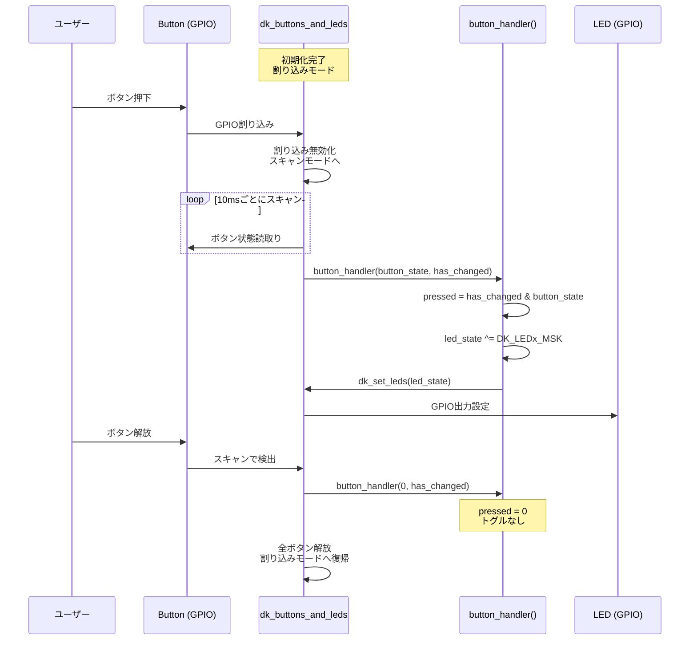

# API Contract: Button Callback Interface

**Feature**: 001-led-toggle-button  
**Date**: 2026-02-11  
**Type**: Internal C API (dk_buttons_and_leds callback)

## 概要

本プロジェクトはREST/GraphQL APIを持たないベアメタル/RTOS組み込みアプリケーションです。
代わりに、`dk_buttons_and_leds`ライブラリのコールバックインターフェースを内部契約として定義します。

## ボタンコールバック契約

### Callback Signature

```c
typedef void (*button_handler_t)(uint32_t button_state, uint32_t has_changed);
```

### パラメータ

| パラメータ | 型 | 説明 |
|-----------|-----|------|
| `button_state` | `uint32_t` | コールバック呼出し時の全ボタンの現在状態（ビットマスク）。ビットが1=押下中、0=解放 |
| `has_changed` | `uint32_t` | 前回スキャンから状態が変化したボタン（ビットマスク）。ビットが1=変化あり |

### ビットマスク定義

| マスク | 値 | 対応ボタン |
|--------|-----|-----------|
| `DK_BTN1_MSK` | `BIT(0)` = 0x01 | Button 1 |
| `DK_BTN2_MSK` | `BIT(1)` = 0x02 | Button 2 |
| `DK_BTN3_MSK` | `BIT(2)` = 0x04 | Button 3 |
| `DK_BTN4_MSK` | `BIT(3)` = 0x08 | Button 4 |

### 呼出し条件

- デバウンス処理（10msスキャン間隔）完了後にのみ呼び出される
- ボタン状態に変化がある場合のみ呼び出される（`has_changed != 0`）
- 割り込みコンテキストではなく、ワークキューコンテキストで呼び出される

### 押下エッジ検出パターン

```c
// 押下エッジ = 「変化あり」かつ「現在押下中」
uint32_t pressed = has_changed & button_state;
```

## LED制御契約

### 関数インターフェース

| 関数 | シグネチャ | 説明 |
|------|-----------|------|
| `dk_leds_init` | `int dk_leds_init(void)` | LED GPIOを出力として初期化。戻り値0=成功 |
| `dk_buttons_init` | `int dk_buttons_init(button_handler_t handler)` | ボタンGPIOを入力+割り込みとして初期化。戻り値0=成功 |
| `dk_set_led` | `int dk_set_led(uint8_t led_idx, uint32_t val)` | 個別LED制御。led_idx=0〜3, val=0(OFF)/1(ON) |
| `dk_set_leds` | `int dk_set_leds(uint32_t leds)` | ビットマスクで全LED一括制御 |

### LEDビットマスク定義

| マスク | 値 | 対応LED |
|--------|-----|--------|
| `DK_LED1_MSK` | `BIT(0)` = 0x01 | LED 1 |
| `DK_LED2_MSK` | `BIT(1)` = 0x02 | LED 2 |
| `DK_LED3_MSK` | `BIT(2)` = 0x04 | LED 3 |
| `DK_LED4_MSK` | `BIT(3)` = 0x08 | LED 4 |

## トグル操作の契約

### 前提条件

- `dk_leds_init()` が成功（戻り値 0）で完了していること
- `dk_buttons_init(button_handler)` が成功（戻り値 0）で完了していること

### 事後条件

- ボタン押下エッジ検出時、対応するLEDの状態が反転すること
- ボタン解放時、LEDの状態は変化しないこと
- 他のボタン-LEDペアの状態に影響しないこと

### エラー処理

| エラー | 条件 | 対応 |
|--------|------|------|
| 初期化失敗 | `dk_leds_init()` or `dk_buttons_init()` != 0 | ログ出力し処理停止 |

## シーケンス図


