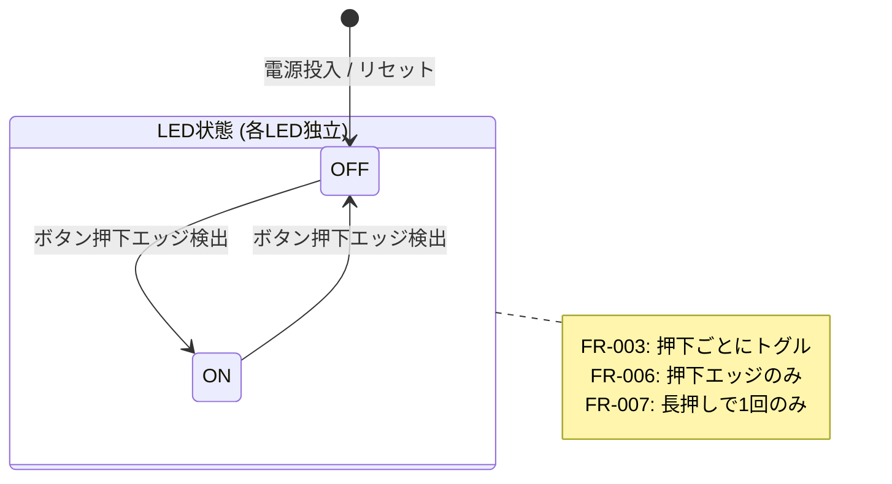
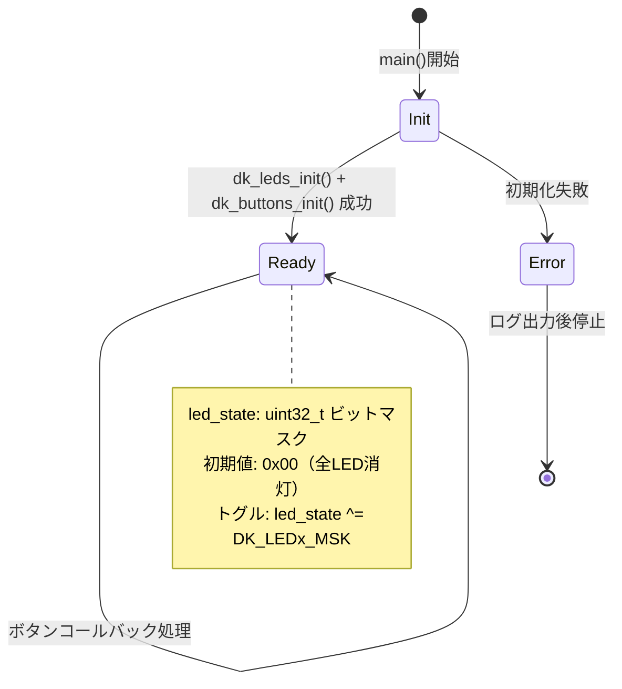

# Data Model: nRF52840DK LED トグル（ボタン操作）

**Feature**: 001-led-toggle-button  
**Date**: 2026-02-11

## エンティティ定義

### 1. LED

物理的な発光ダイオード。点灯または消灯の2つの状態を持つ。

| フィールド | 型 | 説明 |
|-----------|-----|------|
| id | int (0-3) | LEDインデックス（DK_LED1=0, DK_LED2=1, DK_LED3=2, DK_LED4=3） |
| state | bool | 現在の状態（true=点灯, false=消灯） |
| gpio_pin | P0.13-P0.16 | 物理GPIOピン（DTS定義済み、コード上は抽象化） |

**初期状態**: すべて消灯（state = false）  
**制約**: state は bool のみ（中間状態なし）

### 2. ボタン

物理的な押しボタンスイッチ。押下/解放の2つの状態を持つ。

| フィールド | 型 | 説明 |
|-----------|-----|------|
| id | int (0-3) | ボタンインデックス（DK_BTN1=0, DK_BTN2=1, DK_BTN3=2, DK_BTN4=3） |
| physical_state | bool | 物理的状態（true=押下中, false=解放） |
| gpio_pin | P0.11, P0.12, P0.24, P0.25 | 物理GPIOピン（DTS定義済み） |

**制約**: アクティブロー（物理的にLOW=押下）、ただしDTS/GPIO APIで論理反転済み

### 3. ボタン-LEDペア（マッピング）

ボタンとLEDの1対1対応関係。

| ボタン | LED | ビットマスク |
|--------|-----|-------------|
| Button 1 (DK_BTN1) | LED 1 (DK_LED1) | DK_BTN1_MSK / DK_LED1_MSK |
| Button 2 (DK_BTN2) | LED 2 (DK_LED2) | DK_BTN2_MSK / DK_LED2_MSK |
| Button 3 (DK_BTN3) | LED 3 (DK_LED3) | DK_BTN3_MSK / DK_LED3_MSK |
| Button 4 (DK_BTN4) | LED 4 (DK_LED4) | DK_BTN4_MSK / DK_LED4_MSK |

**関係**: Button N → LED N は固定の1対1マッピング（N = 1〜4）

## 状態遷移図



## アプリケーション状態



## 内部データ表現

アプリケーション内でのLED状態管理:

```
led_state (uint32_t):
  Bit 0: LED 1 (0=消灯, 1=点灯)
  Bit 1: LED 2 (0=消灯, 1=点灯)
  Bit 2: LED 3 (0=消灯, 1=点灯)
  Bit 3: LED 4 (0=消灯, 1=点灯)
  Bits 4-31: 未使用（常に0）

初期値: 0x00000000

トグル操作: led_state ^= DK_LEDx_MSK
LED反映:   dk_set_leds(led_state)
```

## バリデーションルール

| ルール | 条件 | 対応するFR |
|--------|------|-----------|
| 初期状態 | 起動時 led_state = 0 | FR-001 |
| トグルトリガー | has_changed & button_state（押下エッジのみ） | FR-006, FR-007 |
| 独立性 | Button NのトグルはLED Nのビットのみ変更 | FR-005 |
| デバウンス | dk_libraryが10msスキャンで処理 | FR-004 |
