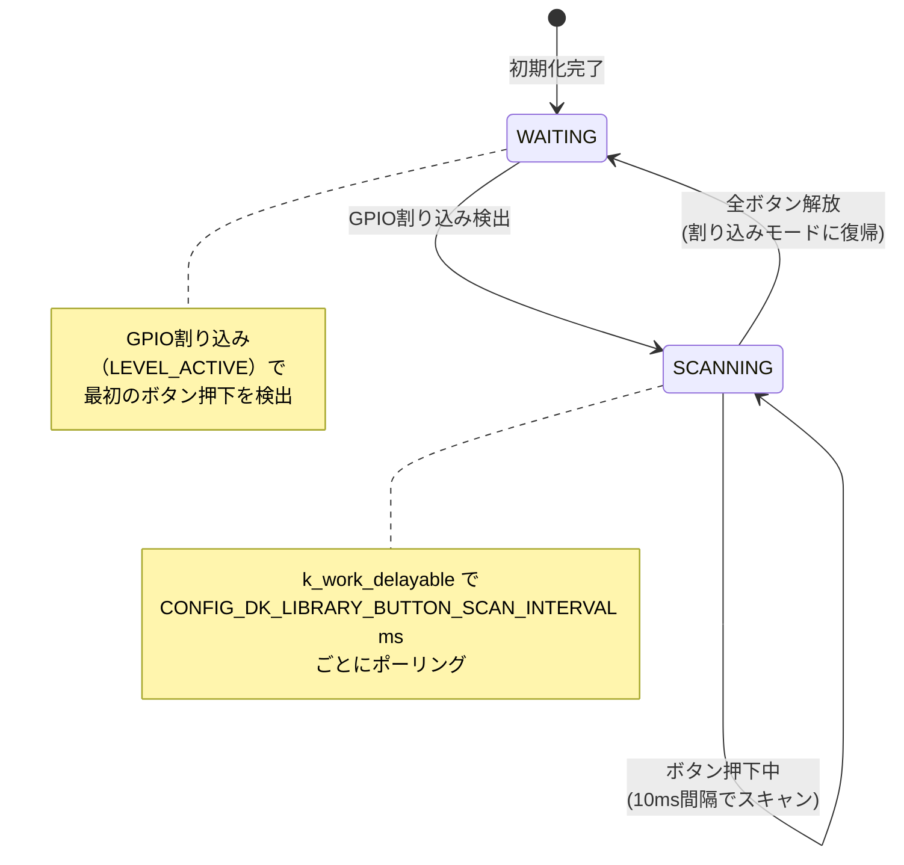
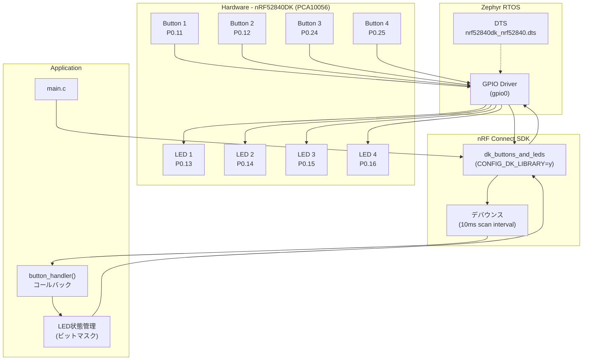

# リサーチ結果: nRF52840DK LED トグルボタンプロジェクト

**調査日**: 2026-02-11  
**対象ボード**: nRF52840DK (PCA10056)  
**SDKバージョン**: nRF Connect SDK / Zephyr RTOS (ワークスペース内ソース基準)

---

## 1. nRF52840DK ハードウェアピンマッピング

**ソース**: [nrf52840dk_nrf52840.dts](../../external/zephyr/boards/arm/nrf52840dk_nrf52840/nrf52840dk_nrf52840.dts)

### LED ピンアサイン

| LED   | DTS ノード | GPIO ポート | ピン番号 | 極性           | ラベル       |
|-------|-----------|------------|---------|----------------|-------------|
| LED 1 | `led0`    | `gpio0`    | P0.13   | `GPIO_ACTIVE_LOW` | Green LED 0 |
| LED 2 | `led1`    | `gpio0`    | P0.14   | `GPIO_ACTIVE_LOW` | Green LED 1 |
| LED 3 | `led2`    | `gpio0`    | P0.15   | `GPIO_ACTIVE_LOW` | Green LED 2 |
| LED 4 | `led3`    | `gpio0`    | P0.16   | `GPIO_ACTIVE_LOW` | Green LED 3 |

### ボタン ピンアサイン

| ボタン   | DTS ノード | GPIO ポート | ピン番号 | フラグ                              | ラベル                   |
|---------|-----------|------------|---------|--------------------------------------|--------------------------|
| Button 1 | `button0` | `gpio0`   | P0.11   | `GPIO_PULL_UP \| GPIO_ACTIVE_LOW`   | Push button switch 0     |
| Button 2 | `button1` | `gpio0`   | P0.12   | `GPIO_PULL_UP \| GPIO_ACTIVE_LOW`   | Push button switch 1     |
| Button 3 | `button2` | `gpio0`   | P0.24   | `GPIO_PULL_UP \| GPIO_ACTIVE_LOW`   | Push button switch 2     |
| Button 4 | `button3` | `gpio0`   | P0.25   | `GPIO_PULL_UP \| GPIO_ACTIVE_LOW`   | Push button switch 3     |

### Decision

- **LEDはアクティブロー**: ピンをLOWにすると点灯、HIGHにすると消灯。DTSで `GPIO_ACTIVE_LOW` が指定されているため、Zephyr GPIO API の `gpio_pin_set_dt(1)` で点灯となる（API がロジック反転を吸収）
- **ボタンはアクティブロー + 内部プルアップ**: ボタンが押されるとGNDに接続されLOWになる。`GPIO_PULL_UP` で内部プルアップ抵抗が有効化される
- **全LED/ボタンが `gpio0` ポート上**: GPIO1は未使用

### Rationale

DTSファイルがハードウェアの真実の情報源（Single Source of Truth）。`GPIO_DT_SPEC_GET` マクロを使えば、これらの設定が自動的にコードに反映される。

### Alternatives Considered

- ハードコーディング（ピン番号を直接コードに書く）→ **不採用**: DTSエイリアス（`led0`, `sw0`等）経由でアクセスするのがZephyrのベストプラクティス

---

## 2. Zephyr GPIO API ベストプラクティス

### 2.1 生Zephyr GPIO API パターン

**ソース**: [samples/basic/button/src/main.c](../../external/zephyr/samples/basic/button/src/main.c)

ボタン入力（割り込みコールバック方式）:

```c
// 1. DTSエイリアスからGPIO仕様を取得
static const struct gpio_dt_spec button = GPIO_DT_SPEC_GET(DT_ALIAS(sw0), gpios);
static struct gpio_callback button_cb_data;

// 2. コールバック関数
void button_pressed(const struct device *dev, struct gpio_callback *cb, uint32_t pins) {
    // ボタン押下時の処理
}

// 3. 初期化シーケンス
gpio_is_ready_dt(&button);                                      // デバイス準備確認
gpio_pin_configure_dt(&button, GPIO_INPUT);                      // 入力ピンとして設定
gpio_pin_interrupt_configure_dt(&button, GPIO_INT_EDGE_TO_ACTIVE); // エッジ割り込み設定
gpio_init_callback(&button_cb_data, button_pressed, BIT(button.pin)); // コールバック初期化
gpio_add_callback(button.port, &button_cb_data);                 // コールバック登録
```

LED出力制御:

```c
// DTSエイリアスからGPIO仕様を取得
static const struct gpio_dt_spec led = GPIO_DT_SPEC_GET(DT_ALIAS(led0), gpios);

gpio_pin_configure_dt(&led, GPIO_OUTPUT);     // 出力ピンとして設定
gpio_pin_toggle_dt(&led);                     // トグル（点灯↔消灯）
gpio_pin_set_dt(&led, 1);                     // ON（アクティブ状態）
gpio_pin_set_dt(&led, 0);                     // OFF（非アクティブ状態）
```

### 2.2 nRF Connect SDK `dk_buttons_and_leds` ライブラリ

**ソース**: [include/dk_buttons_and_leds.h](../../external/nrf/include/dk_buttons_and_leds.h), [lib/dk_buttons_and_leds/dk_buttons_and_leds.c](../../external/nrf/lib/dk_buttons_and_leds/dk_buttons_and_leds.c)

Nordic公式の高レベルラッパーライブラリ:

```c
#include <dk_buttons_and_leds.h>

// コールバック関数
void button_handler(uint32_t button_state, uint32_t has_changed) {
    if (has_changed & DK_BTN1_MSK) {
        // Button 1 の状態変化
    }
}

// 初期化
dk_leds_init();
dk_buttons_init(button_handler);

// LED制御
dk_set_led(DK_LED1, 1);          // LED1 ON
dk_set_led_on(DK_LED1);          // LED1 ON
dk_set_led_off(DK_LED1);         // LED1 OFF
dk_set_leds(DK_LED1_MSK | DK_LED3_MSK); // LED1とLED3をON、他はOFF
```

**有効化**: `prj.conf` に `CONFIG_DK_LIBRARY=y` を追加

### Decision

**`dk_buttons_and_leds` ライブラリを使用する**

### Rationale

| 観点                 | 生Zephyr GPIO API                | dk_buttons_and_leds         |
|----------------------|----------------------------------|-----------------------------|
| デバウンス           | 自前実装が必要                   | **内蔵（自動）**            |
| 割り込み管理         | 手動で設定                       | **自動管理**                |
| LED/ボタン抽象化     | DTSエイリアス個別アクセス         | **マスク操作で一括制御**    |
| コード量             | 多い（初期化手順が長い）          | **少ない（2関数で初期化）** |
| Nordic DK依存        | 汎用（任意ボードで動作）          | Nordic DK向け（DTS前提）    |
| トグルAPI            | `gpio_pin_toggle_dt()` あり      | **なし（自前管理が必要）**  |

- Nordic DK専用プロジェクトのため、`dk_buttons_and_leds` が最適
- ただし、`dk_buttons_and_leds` にはLEDトグルAPIがないため、**LED状態を変数で管理するか、生GPIO APIの `gpio_pin_toggle_dt()` を併用**する必要がある

### Alternatives Considered

1. **生Zephyr GPIO APIのみ**: 移植性が高いが、デバウンス処理を自前実装する必要がある → specの FR-004 デバウンス要件を自前実装するのはリスク
2. **Zephyr Input Subsystem** (`zephyr,code` property): DTSに `INPUT_KEY_x` が定義済みだが、LED制御との組み合わせが複雑 → 不採用

---

## 3. Zephyr デバウンスパターン

**ソース**: [lib/dk_buttons_and_leds/dk_buttons_and_leds.c](../../external/nrf/lib/dk_buttons_and_leds/dk_buttons_and_leds.c), [lib/dk_buttons_and_leds/Kconfig](../../external/nrf/lib/dk_buttons_and_leds/Kconfig)

### Decision

**`dk_buttons_and_leds` ライブラリの内蔵デバウンスを使用する（スキャン間隔: 10ms）**

### デバウンスの仕組み（ライブラリ内部動作）



### 動作の流れ

1. **WAITINGステート**: GPIO割り込み（`GPIO_INT_LEVEL_ACTIVE`）で最初のボタン押下を待機
2. **ボタン押下検出**: 割り込み発生 → 割り込みを無効化 → SCANNINGステートへ遷移
3. **SCANNINGステート**: `k_work_delayable` で `CONFIG_DK_LIBRARY_BUTTON_SCAN_INTERVAL` ms（**デフォルト10ms**）ごとにボタン状態をポーリング
4. **状態変化検出**: 前回スキャンと異なる場合のみコールバックを呼び出し
5. **全ボタン解放**: 割り込みを再有効化 → WAITINGステートに復帰

### Kconfig デフォルト値

```kconfig
config DK_LIBRARY_BUTTON_SCAN_INTERVAL
    int "Scanning interval of buttons in milliseconds"
    default 50 if DK_LIBRARY_BUTTON_NO_ISR
    default 10
```

- **割り込みモード（デフォルト）**: スキャン間隔 **10ms**
- **ポーリングモード（`BUTTON_NO_ISR`）**: スキャン間隔 50ms

### Rationale

- spec の FR-004 では「デバウンス時間15ms」と規定されている
- `dk_buttons_and_leds` のデフォルトスキャン間隔は **10ms** で、ボタン状態が2回連続で同じ値を示して初めてコールバックが発火するため、実効デバウンス時間は **10〜20ms** 程度
- 15ms の仕様要件に対して十分な精度を持つ
- **注意**: 厳密に15msのデバウンスが必要な場合は、`CONFIG_DK_LIBRARY_BUTTON_SCAN_INTERVAL=15` をprj.confで設定可能

### Alternatives Considered

1. **自前のソフトウェアデバウンス（タイマー使用）**: 生GPIO APIのコールバック内で `k_work_delayable` を使い15ms後に状態確認 → 実装量が増える、dk_libraryに同等機能が内蔵されている
2. **ハードウェアデバウンス（RCフィルタ）**: 外部回路が必要 → DKボードを改造する必要があり不適切
3. **Zephyr Input Subsystem のデバウンス**: `zephyr,debounce-interval-ms` DTSプロパティ → 使えるが `dk_buttons_and_leds` との併用は複雑

---

## 4. nRF Connect SDK サンプルリファレンス

### 4.1 Zephyr 標準 Button サンプル

**ソース**: [samples/basic/button/](../../external/zephyr/samples/basic/button/)

#### CMakeLists.txt パターン

```cmake
cmake_minimum_required(VERSION 3.20.0)
find_package(Zephyr REQUIRED HINTS $ENV{ZEPHYR_BASE})
project(button)

target_sources(app PRIVATE src/main.c)
```

#### prj.conf パターン

```conf
CONFIG_GPIO=y
```

#### main.c パターン（要約）

- `GPIO_DT_SPEC_GET` でDTSエイリアス（`sw0`, `led0`）からピン仕様を取得
- `gpio_pin_configure_dt()` で入力/出力を設定
- `gpio_pin_interrupt_configure_dt()` + `gpio_init_callback()` + `gpio_add_callback()` で割り込みコールバックを登録
- メインループで `gpio_pin_get_dt()` でボタン状態を読み取り、`gpio_pin_set_dt()` でLEDに反映

### 4.2 Zephyr 標準 Blinky サンプル

**ソース**: [samples/basic/blinky/](../../external/zephyr/samples/basic/blinky/)

- 最小構成: `gpio_pin_configure_dt()` + `gpio_pin_toggle_dt()` + `k_msleep()` ループ
- LED トグルには `gpio_pin_toggle_dt()` を使用

### 4.3 dk_buttons_and_leds を使うプロジェクトのパターン

```cmake
cmake_minimum_required(VERSION 3.20.0)
find_package(Zephyr REQUIRED HINTS $ENV{ZEPHYR_BASE})
project(led_toggle_button)

target_sources(app PRIVATE src/main.c)
```

```conf
CONFIG_GPIO=y
CONFIG_DK_LIBRARY=y
```

```c
#include <zephyr/kernel.h>
#include <dk_buttons_and_leds.h>

static void button_handler(uint32_t button_state, uint32_t has_changed)
{
    // button_state: 現在の全ボタン状態（ビットマスク）
    // has_changed:  変化があったボタン（ビットマスク）
    if (has_changed & DK_BTN1_MSK) {
        dk_set_led(DK_LED1, button_state & DK_BTN1_MSK ? 1 : 0);
    }
}

int main(void)
{
    dk_leds_init();
    dk_buttons_init(button_handler);
    return 0;  // Zephyrはmainリターン後もカーネルが動作し続ける
}
```

### Decision

**`dk_buttons_and_leds` ライブラリを使用した最小構成パターンを採用する**

### Rationale

- Zephyr 標準 button サンプルはデバウンスが無い（FR-004 不適合）
- `dk_buttons_and_leds` は Nordic DK 向けに最適化されており、初期化が2関数で完了
- ただし、spec要件の「**トグル**」動作（押すたびに反転）には、ボタンの**押下エッジ（`has_changed` かつ `button_state`）**でのみ反応する必要がある

### Alternatives Considered

1. **Zephyr button サンプルベース**: シンプルだがデバウンスなし → 不採用
2. **CAF (Common Application Framework)**: `buttons_def.h` を使うパターンがサンプルに存在するが、LED トグルには過剰 → 不採用

---

## 5. ビルドシステム

### Decision

**最小3ファイル構成: `CMakeLists.txt` + `prj.conf` + `src/main.c`**

### 最小ファイル構成

```
project/
├── CMakeLists.txt      # 必須: ビルドシステム定義
├── prj.conf            # 必須: Kconfig設定
└── src/
    └── main.c          # 必須: アプリケーションコード
```

#### CMakeLists.txt（最小構成）

```cmake
cmake_minimum_required(VERSION 3.20.0)
find_package(Zephyr REQUIRED HINTS $ENV{ZEPHYR_BASE})
project(led_toggle_button)

target_sources(app PRIVATE src/main.c)
```

#### prj.conf（本プロジェクト用）

```conf
CONFIG_GPIO=y
CONFIG_DK_LIBRARY=y
CONFIG_LOG=y
CONFIG_DK_LIBRARY_LOG_LEVEL_INF=y
```

#### app.overlay

**本プロジェクトでは不要**。nRF52840DKのDTSにはLED 1-4 / Button 1-4 がすでに定義されているため、オーバーレイでの追加定義は不要。

### ビルドコマンド

```bash
# 基本ビルド
west build -b nrf52840dk_nrf52840 -d build

# クリーンビルド
west build -b nrf52840dk_nrf52840 -d build --pristine

# フラッシュ（書き込み）
west flash -d build
```

### Rationale

- `CMakeLists.txt`: Zephyrのビルドシステムは CMake ベース。`find_package(Zephyr)` が必須
- `prj.conf`: `CONFIG_GPIO=y` はGPIOサブシステムの有効化、`CONFIG_DK_LIBRARY=y` は `dk_buttons_and_leds` の有効化（これにより `CONFIG_GPIO=y` も自動選択される）
- `app.overlay`: DTS にすでにハードウェア定義があるため不要。カスタムハードウェアの場合のみ必要
- `-b nrf52840dk_nrf52840` はボード識別子。DTSファイル名と一致

### Alternatives Considered

1. **app.overlay で独自デバイス定義**: 不要なオーバーレイは保守コストが増える → 不採用
2. **Sysbuild 構成**: MCUboot等のブートローダーを含むマルチイメージビルド → 本プロジェクトには過剰 → 不採用
3. **`CONFIG_GPIO=y` の明示的記述**: `CONFIG_DK_LIBRARY` が `select GPIO` で自動選択するが、明示的に書くことで可読性向上 → 明示的記述を推奨

---

## 6. 実装上の注意点（spec との照合）

### トグル動作の実装パターン

spec の FR-003, FR-006, FR-007 を満たすには、`dk_buttons_and_leds` のコールバックで**ボタン押下エッジのみ**に反応する必要がある:

```c
static void button_handler(uint32_t button_state, uint32_t has_changed)
{
    // has_changed: どのボタンが変化したか
    // button_state: 変化後の状態（1=押下, 0=解放）

    // ボタン押下時（エッジ）のみ反応（FR-006, FR-007）
    uint32_t pressed = has_changed & button_state;

    if (pressed & DK_BTN1_MSK) {
        // LED 1 をトグル（FR-003）
    }
    if (pressed & DK_BTN2_MSK) {
        // LED 2 をトグル
    }
    // ... BTN3, BTN4 同様
}
```

### LED トグルの選択肢

`dk_buttons_and_leds` にはトグルAPIがないため:

| 方法 | コード例 | 利点 | 欠点 |
|------|---------|------|------|
| 状態変数管理 | `led_state ^= DK_LED1_MSK; dk_set_leds(led_state);` | dk_library に閉じる | 変数の同期管理が必要 |
| 個別LED制御 | `static bool led1; led1 = !led1; dk_set_led(DK_LED1, led1);` | シンプル | LED数分のフラグが必要 |
| 生GPIO API併用 | `gpio_pin_toggle_dt(&leds[idx]);` | APIがトグルを直接サポート | dk_library と直接GPIO操作の混在 |

**推奨**: 状態変数（ビットマスク）管理方式。`dk_set_leds()` で一貫した制御が可能。

---

## 全体アーキテクチャ図


